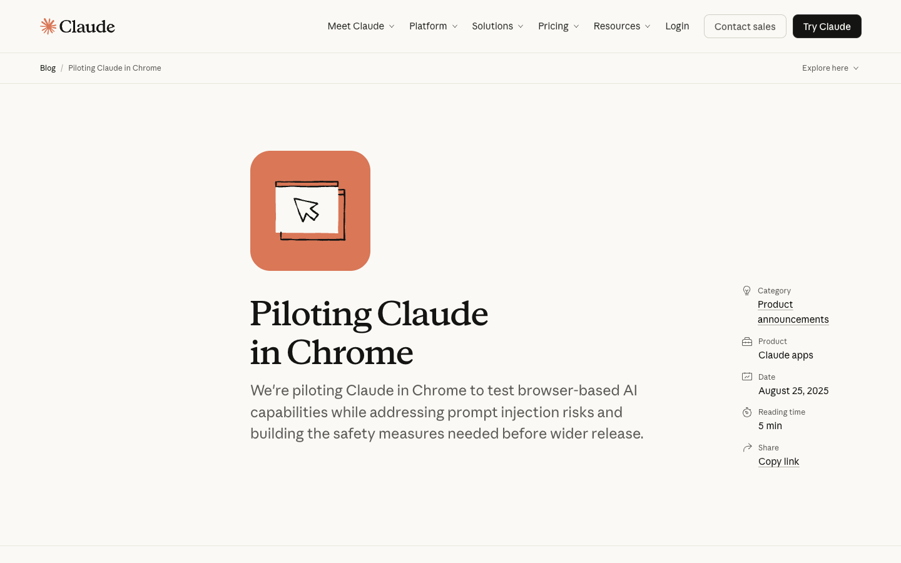
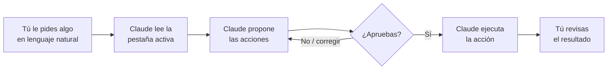
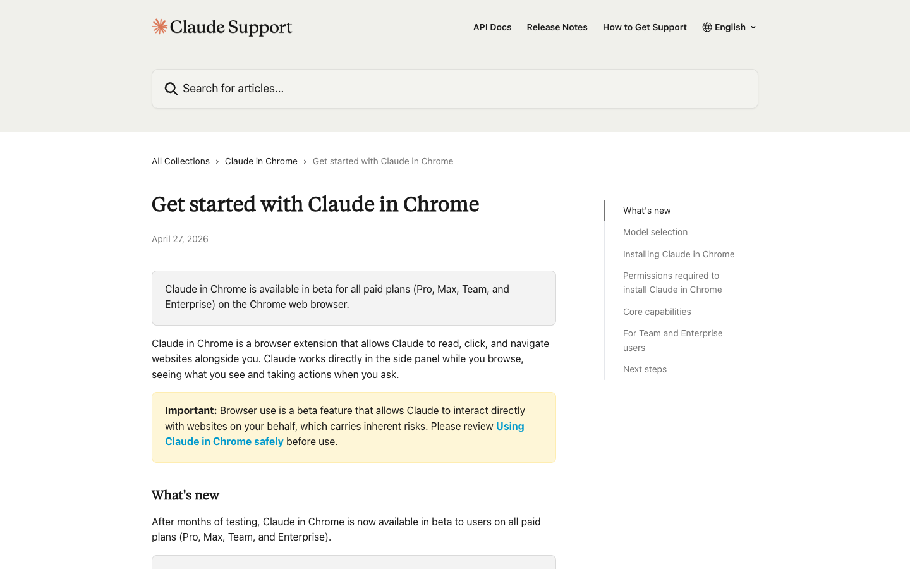
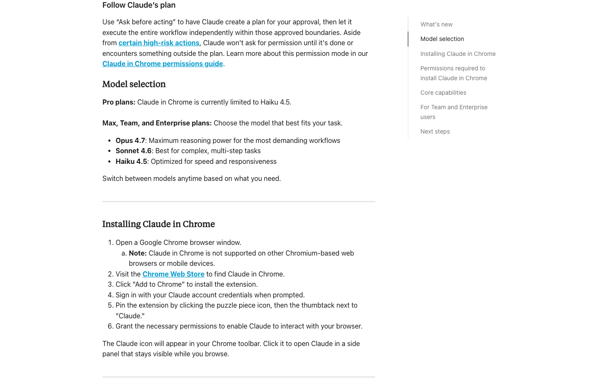
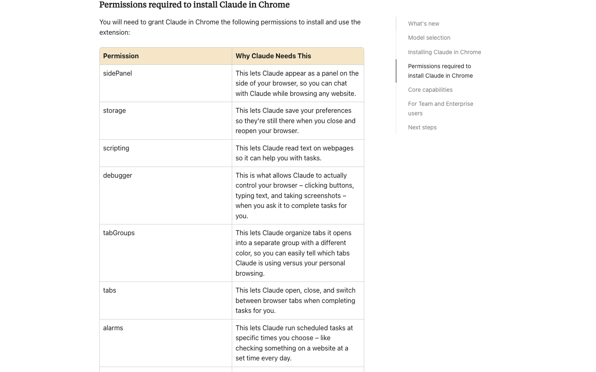
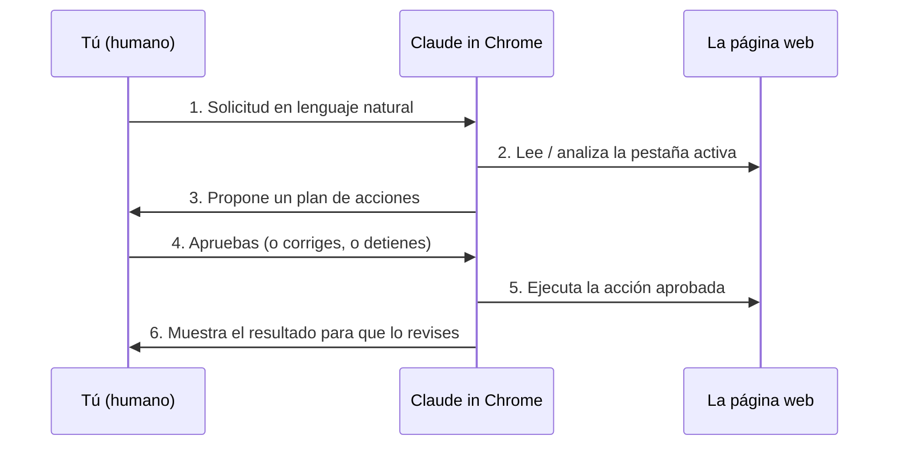
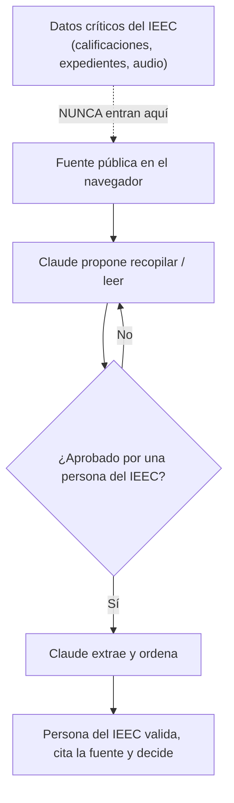

# Guía de referencia — Claude in Chrome

> **Para el Taller de IA con Claude Code del IEEC.**
> Guía de referencia en español (es-MX) para entender qué es *Claude in
> Chrome*, cómo se habilita, qué puede y qué no puede hacer, y cómo usarlo
> sin poner en riesgo los datos del IEEC.
>
> **Audiencia:** equipos del IEEC que **no** programan. No necesitas saber
> código para leer esta guía.
>
> **Verificación:** la información de producto está verificada contra la
> documentación oficial de Anthropic (ver «Fuentes» al final). Las funciones
> y la disponibilidad cambian rápido; donde algo puede haber cambiado, lo
> marcamos con «al momento de escribir, …».

---

## 1. ¿Qué es Claude in Chrome?

Claude in Chrome es una **extensión para el navegador Google Chrome** que le
da a Claude ojos y manos dentro de tu navegador. Es un producto **distinto**
de los otros dos que ya viste en el taller:

| Producto | Dónde vive | Qué controla |
|----------|-----------|--------------|
| **Claude Code** | la terminal (CLI) | tu proyecto y tus archivos en el disco |
| **Cowork** (app de escritorio) | una app aparte | archivos y tareas de oficina en tu computadora |
| **Claude in Chrome** | una extensión dentro de Chrome | **la pestaña que tienes abierta en el navegador** |

La idea central es sencilla: **Claude ve la pestaña activa de tu navegador**
y, a partir de lo que le pides, **propone acciones** —navegar a una página,
hacer clic en un botón, llenar un formulario, leer el texto de la pantalla,
tomar una captura (screenshot)— y **tú apruebas** antes de que las ejecute.

*Capturas tomadas de la documentación pública de Anthropic.*

El ciclo que debes memorizar es:

> **Claude propone → tú decides.**

Claude **nunca** actúa por su cuenta en acciones delicadas. Te enseña primero
qué piensa hacer; tú das el visto bueno (o lo corriges, o lo detienes). Esa
aprobación humana no es un detalle: es el mecanismo de seguridad principal de
todo el sistema (ver la sección 7).

---

## 2. Prerrequisitos

Al momento de escribir, para usar Claude in Chrome necesitas:

| Requisito | Detalle |
|-----------|---------|
| **Una suscripción de pago a Claude** | Pro, Max, Team o Enterprise. Está disponible en **todos los planes de pago**. |
| **El navegador Google Chrome** | Solo Chrome. **No** funciona en otros navegadores basados en Chromium (Edge, Brave, Arc, etc.) ni en dispositivos móviles. |
| **La extensión instalada** | Se instala desde la Chrome Web Store (ver sección 4). |
| **Tu cuenta de Claude** | Inicias sesión con las mismas credenciales que usas en claude.ai. |

### Una nota sobre cómo cambió la disponibilidad

Este producto se abrió por etapas, y es útil saberlo porque vas a encontrar
artículos viejos que dicen cosas distintas:

- **Agosto 2025** — arrancó como *research preview* (vista previa de
  investigación) con solo 1 000 usuarios del plan **Max**, por lista de
  espera.
- **Noviembre 2025** — se amplió a **todos** los suscriptores de Max.
- **Diciembre 2025** — se amplió a **todos los planes de pago**
  (Pro, Max, Team, Enterprise).

Por eso, si lees que «es solo para Max» o «es solo research preview», esa
información está **desactualizada**. Al momento de escribir, basta un plan de
pago. Aun así, sigue siendo una capacidad joven; trátala como tal.

### ¿Qué modelo usa?

El modelo de Claude disponible depende de tu plan (al momento de escribir):

- **Pro** — limitado a **Haiku 4.5**.
- **Max / Team / Enterprise** — puedes elegir entre **Opus 4.8** (o 4.7),
  **Sonnet 4.6** o **Haiku 4.5** (al momento de escribir; la disponibilidad
  evoluciona).

---

## 3. ¿Quién puede activarlo en una organización?

Si IEEC usa un plan **Team** o **Enterprise**, la extensión la controla un
administrador:

- El administrador puede **habilitar o deshabilitar** la extensión para toda
  la organización.
- El administrador puede configurar **listas de sitios permitidos**
  (*allowlist*) y **listas de sitios bloqueados** (*blocklist*).

Esto importa para el IEEC: significa que se puede acotar institucionalmente
en qué sitios se permite usar Claude in Chrome y en cuáles no.

---

## 4. Cómo habilitarlo — primeros pasos

> Estos pasos reflejan la interfaz al momento de escribir. La ubicación exacta
> de algún botón puede cambiar con las actualizaciones de Chrome o de la
> extensión.

1. **Abre Google Chrome.** (Recuerda: solo Chrome.)
2. **Ve a la Chrome Web Store** y busca **«Claude in Chrome»** (la extensión
   oficial de Anthropic).
3. Haz clic en **«Add to Chrome» / «Agregar a Chrome»** para instalarla.
4. **Inicia sesión** con las credenciales de tu cuenta de Claude (las mismas
   de claude.ai).
5. **Fija la extensión** para tenerla a la mano: haz clic en el ícono de la
   pieza de rompecabezas (🧩) en la barra de Chrome y luego en la chincheta
   (📌) junto a «Claude».
6. **Concede los permisos** que la extensión solicite cuando te lo pida.

> **Sobre los permisos del navegador:** al instalarse, la extensión pide una
> lista amplia de permisos de Chrome (acceso a pestañas, a *scripting*, al
> *debugger*, a almacenamiento, etc.). Son los permisos técnicos que la
> extensión necesita para «ver» y «actuar» en la pestaña. Esto **no** es lo
> mismo que el permiso para actuar en un sitio concreto: ese se otorga sitio
> por sitio, cada vez (ver sección 5).

Antes de tu primer uso real, Anthropic recomienda leer su artículo **«Using
Claude in Chrome safely»** (usar Claude in Chrome de forma segura). No te lo
saltes: la automatización del navegador tiene riesgos reales (sección 7).

---

## 5. Cómo funciona — el modelo de permisos y la supervisión humana

Claude in Chrome está construido sobre tres ideas que conviene entender bien.

### a) Permisos por sitio

El acceso de Claude **no es general**: se concede **sitio por sitio**. En la
configuración de la extensión puedes **otorgar o revocar** el acceso de Claude
a sitios web específicos, y puedes cambiar esos permisos cuando quieras.

> Regla práctica: dale acceso solo a los sitios donde realmente lo vas a usar,
> y revócalo cuando termines.

### b) «Pregunta antes de actuar» (*Ask before acting*)

La extensión tiene un modo en el que Claude primero **arma un plan** de lo que
va a hacer y te lo muestra **antes** de ejecutarlo. Para ciertas acciones de
**alto riesgo** —publicar algo, hacer una compra, compartir datos
personales— **siempre** debe pedir tu aprobación explícita, incluso en los
modos más autónomos.

### c) El flujo completo

Cada tarea sigue este recorrido. Tú estás en el bucle en todo momento:

1. **Solicitud** — le dices en lenguaje natural qué quieres lograr.
2. **Análisis de la página** — Claude lee el contenido de la pestaña activa.
3. **Propuesta** — te muestra qué acciones piensa tomar.
4. **Aprobación** — tú decides: sí, corregir o detener.
5. **Acción** — Claude ejecuta solo lo aprobado.
6. **Revisión** — tú verificas el resultado.

El punto 4 es tu **punto de control de seguridad**. Si el plan no te cuadra,
no lo apruebes.

---

## 6. Capacidades

Lo que Claude in Chrome puede hacer dentro de una pestaña:

| Capacidad | Qué significa | Ejemplo para el IEEC |
|-----------|---------------|----------------------|
| **Navegar** | Ir a una URL, moverse entre páginas, abrir y gestionar varias pestañas | Abrir un portal de noticias o un tablero de indicadores |
| **Leer el contenido** | Extraer y procesar el texto que hay en la pantalla | Leer una nota de prensa y resumirla |
| **Hacer clic e interactuar** | Pulsar botones, menús, casillas | Filtrar resultados en un buscador |
| **Llenar formularios** | Escribir en campos de texto y enviar formularios | Capturar datos en un portal (con tu aprobación) |
| **Tomar screenshots** | Capturar la pantalla para «entender» visualmente la página | Guardar evidencia de cómo se veía un dato |
| **Scraping ligero** | Recopilar de forma puntual datos públicos de una página | Juntar titulares de una sección de noticias |
| **Automatizar tareas web repetitivas** | Repetir un flujo manual que harías a mano | Revisar cada semana el mismo conjunto de sitios |
| **Leer la consola y la red (debugging)** | Ver errores de la consola y peticiones de red de una página | Apoyar a un equipo técnico a entender por qué un tablero no carga |

> Al momento de escribir, la extensión también incluye gestión de varias
> pestañas, *shortcuts* (prompts reutilizables) y la posibilidad de grabar y
> programar flujos de trabajo. Estas funciones avanzadas evolucionan rápido;
> revisa la documentación oficial para el estado más reciente.

### Una nota sobre el uso con Claude Code

Claude in Chrome también se integra con **Claude Code**: puedes construir algo
en tu terminal y **verificarlo en el navegador**, con Claude leyendo los
errores de la consola y el estado del DOM directamente. Para los equipos
técnicos del IEEC, esto convierte al navegador en una herramienta de
depuración, no solo de consulta.

---

## 7. Seguridad y límites (lee esto con cuidado)

Esta es la sección más importante de la guía. La automatización del navegador
es poderosa **y** arriesgada. Aquí va lo honesto.

### 7.1 Prompt injection — el riesgo central

Una página web maliciosa puede **esconder instrucciones** dirigidas a Claude
dentro de su contenido (texto invisible, comentarios, un correo trampa, etc.).
A esto se le llama **prompt injection**: el atacante no te ataca a ti
directamente, le «habla» a la IA para que haga algo que tú no pediste —por
ejemplo, borrar correos, enviar datos o hacer clic en un enlace de *phishing*.

Por eso **la aprobación humana importa tanto**. Tú eres el filtro que detiene
una acción que Claude no debería haber propuesto.

Los números públicos de Anthropic dan la dimensión del riesgo (y de por qué la
supervisión sigue siendo necesaria):

- Sin mitigaciones, en pruebas con ataques deliberados, la **tasa de éxito de
  los ataques fue de 23.6 %**.
- Con las defensas nuevas (modo autónomo), bajó a **11.2 %**.
- En ataques específicos del navegador, bajó de **35.7 % a 0 %**.

Lee esos números con realismo: **11.2 % no es 0 %**. Las defensas ayudan,
pero **no eliminan** el riesgo. La supervisión humana no es opcional.

### 7.2 Datos sensibles — qué ve Claude y a dónde va

Lo que Claude «ve» en la pestaña activa **se envía a Anthropic** para que el
modelo pueda razonar sobre la página. Consecuencia directa para el IEEC:

> **No uses Claude in Chrome con datos críticos del IEEC.** Calificaciones,
> expedientes de estudiantes, audio de entrevistas, datos personales
> identificables y notas internas **no** deben quedar a la vista de la pestaña
> mientras la extensión está activa.

Esto es coherente con la regla de **dignidad de los datos** del IEEC: las
tareas de sensibilidad crítica se procesan **localmente, con humano en el
bucle**, y los datos **no salen del perímetro** sin consentimiento. Claude in
Chrome es para **fuentes públicas**, no para datos confidenciales.

Anthropic además recomienda **evitar** usar la extensión en sitios que
involucren información **financiera, legal, médica** u otra información
sensible. De hecho, bloquea por diseño categorías de alto riesgo (servicios
financieros, contenido para adultos, contenido pirata).

### 7.3 Diálogos del navegador que bloquean la sesión

Los cuadros de diálogo nativos del navegador —`alert`, `confirm`, `prompt`
(esas ventanitas emergentes que te piden «Aceptar / Cancelar»)— **bloquean** la
sesión de Claude in Chrome: la página se «congela» esperando una respuesta que
la extensión no maneja bien. **Evita** flujos y sitios que disparen estos
diálogos.

### 7.4 No lo dejes correr sin supervisión

Los permisos son **por sitio**, pero el juicio sigue siendo tuyo. **Nunca**
dejes a Claude in Chrome trabajando solo en sitios con **acciones
destructivas o irreversibles**: borrar registros, enviar mensajes o correos,
realizar pagos, publicar contenido. Para esas acciones, quédate presente y
aprueba cada paso.

### 7.5 Resumen de seguridad

| Riesgo | Mitigación |
|--------|-----------|
| Prompt injection desde una página maliciosa | Aprobación humana de cada acción; revisar el plan antes de aprobar |
| Datos sensibles enviados a Anthropic | No abrir datos críticos del IEEC con la extensión activa |
| Diálogos `alert`/`confirm`/`prompt` que congelan la sesión | Evitar sitios y flujos que los disparen |
| Acciones destructivas (borrar, enviar, pagar) | No dejar correr sin supervisión; aprobar paso a paso |
| Acceso demasiado amplio | Otorgar permisos sitio por sitio y revocarlos al terminar |

---

## 8. Qué NO puede hacer

- **No** funciona fuera de Chrome (ni en otros navegadores Chromium ni en
  móvil).
- **No** actúa en acciones de alto riesgo sin tu aprobación (publicar,
  comprar, compartir datos personales): eso es a propósito, es la
  característica de seguridad.
- **No** debe usarse en sitios financieros, legales o médicos; bloquea por
  diseño categorías como servicios financieros, contenido para adultos y
  contenido pirata.
- **No** maneja bien los diálogos nativos del navegador (`alert`/`confirm`/
  `prompt`): lo bloquean.
- **No** es infalible frente a prompt injection: la tasa de éxito de ataques
  baja, pero no llega a cero. No es un sustituto de tu criterio.
- **No** debe tocar datos críticos del IEEC: lo que ve la pestaña se envía a
  Anthropic.
- **No** lo conviertas en un proceso desatendido para tareas destructivas
  (borrar, enviar, pagar).

---

## 9. Casos de uso para el IEEC

Estos casos atan la herramienta a líneas de trabajo reales del IEEC. En todos,
aplica la misma regla: **fuentes públicas, humano en el bucle, los datos
sensibles no salen del perímetro**.

> **Nota sobre nombres:** en esta guía usamos «Equipo» y «Línea» como
> equivalentes. La línea de Difusión (Línea 5), la de Habilidades y mercado
> laboral (Línea 3) y la de Infraestructura/movilizaciones (Línea 4)
> corresponden a los equipos mencionados abajo.

### Equipo 5 — Difusión e incidencia: monitoreo y sistematización de noticias

Claude in Chrome puede abrir portales de noticias y secciones de prensa
educativa, **leer** las notas, **extraer** los titulares y bajadas relevantes
y ayudarte a **sistematizarlos** (clasificar por tema, por fecha, por entidad).

- **Cómo:** «Abre esta sección de noticias, lee los titulares de hoy sobre
  educación y resúmelos en una tabla con fecha, medio y tema.»
- **Regla de dignidad de datos:** las notas de prensa son públicas; no hay
  problema. La sistematización final y la decisión editorial las hace una
  persona del IEEC.

### Equipo 3 — Habilidades y mercado laboral: bolsas de trabajo, Conocer y tableros

Para esta línea, que trabaja con fuentes como **Conocer**, **ENOE** e
**IMSS**, Claude in Chrome puede:

- Hacer **scraping ligero** de bolsas de trabajo públicas para reunir, por
  ejemplo, qué competencias piden ciertas vacantes.
- Navegar por el portal de **Conocer** y leer estándares de competencia
  publicados.
- Abrir **tableros de indicadores** públicos, leer las cifras visibles y
  ayudarte a capturarlas de forma trazable.

- **Cómo:** «Abre esta bolsa de trabajo, busca vacantes de [perfil] en [estado]
  y arma una lista con puesto, competencias solicitadas y fecha.»
- **Regla de dignidad de datos:** usa solo datos **agregados y públicos**.
  Cualquier dato personal de aspirantes queda fuera. Cada cifra que termine en
  un tablero debe poder rastrearse a su fuente (criterio de trazabilidad del
  IEEC).

### Equipo 4 — Infraestructura y movilizaciones: recopilación de movilizaciones magisteriales

Claude in Chrome puede **recopilar** de fuentes públicas (notas de prensa,
comunicados, redes abiertas) información sobre **movilizaciones magisteriales**:
fecha, lugar, demandas reportadas, fuente.

- **Cómo:** «Revisa estas fuentes de noticias, encuentra las movilizaciones
  magisteriales reportadas esta semana y arma una tabla con fecha, entidad,
  demanda y enlace a la fuente.»
- **Regla de dignidad de datos:** trabaja con información **pública** y **cita
  siempre la fuente**. No infieras ni publiques datos personales de personas
  participantes. La interpretación —qué significa esa movilización— la hace el
  equipo, no la IA.

### La regla que se repite en los tres casos

> **En una frase:** Claude in Chrome es un asistente para **mirar y ordenar lo
> público** del navegador. La validación, la cita de la fuente y toda decisión
> sobre personas siguen siendo del IEEC. Los datos sensibles **no salen del
> perímetro**.

---

## Fuentes

Información de producto verificada (junio 2026) contra documentación oficial de
Anthropic:

- Anuncio oficial «Piloting Claude in Chrome» — <https://claude.com/blog/claude-for-chrome>
- Centro de ayuda «Getting started with Claude in Chrome» — <https://support.claude.com/en/articles/12012173-getting-started-with-claude-for-chrome>
- Documentación de Claude Code «Use Claude Code with Chrome (beta)» — <https://code.claude.com/docs/en/chrome>
- Investigación «Mitigating the risk of prompt injections in browser use» — <https://www.anthropic.com/research/prompt-injection-defenses>
