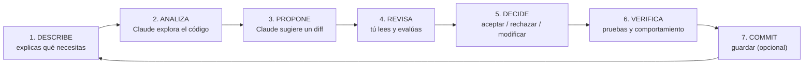
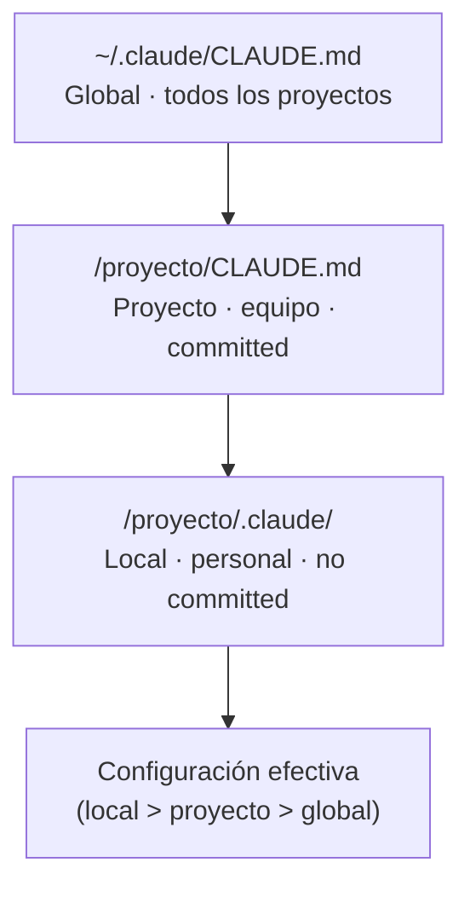
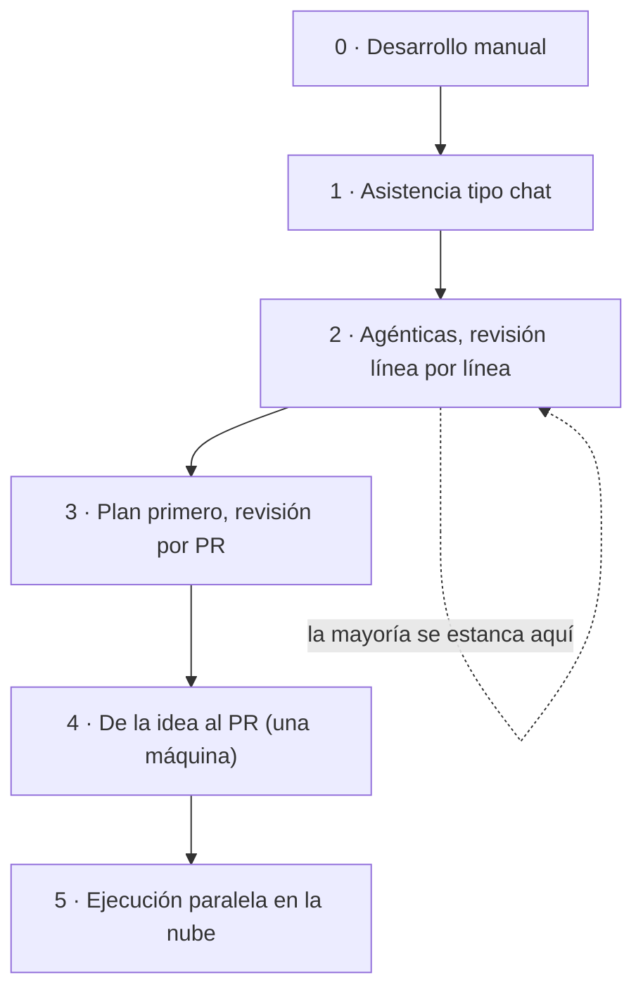
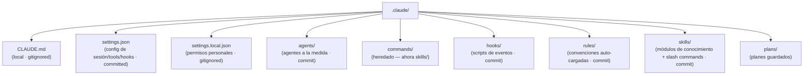
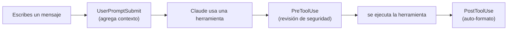
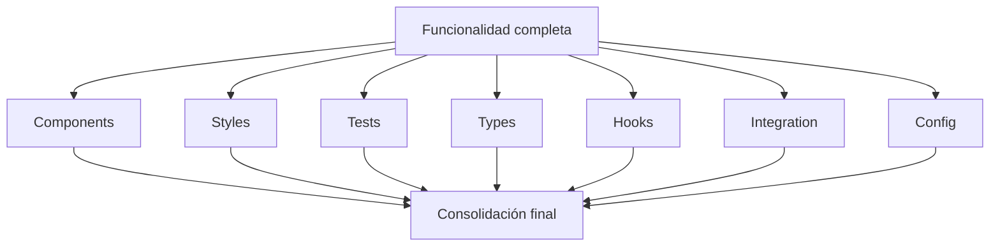
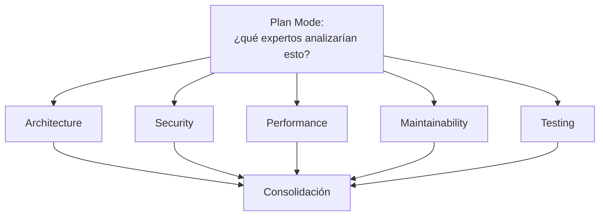
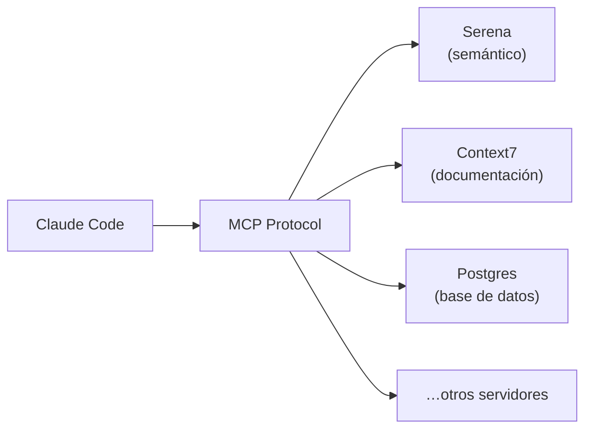

# Guía de referencia de Claude Code — Taller del IEEC

> **Para el Taller de IA con Claude Code del IEEC.**
> Guía de referencia en español (es-MX) que reúne, en un solo lugar, los
> conceptos y las técnicas de trabajo con *Claude Code* que vimos en la
> Sesión 2. Cada sección abre con una frase en lenguaje sencillo —«por qué
> importa»— y luego entra en el detalle.
>
> **Audiencia:** equipos del IEEC que **no** programan. No necesitas saber
> código para leer esta guía. Conservamos en inglés solo lo que se escribe
> literalmente en la herramienta: nombres de comandos (`/compact`, `/plan`…),
> rutas de archivo, nombres de eventos, nombres de modelos (Haiku/Sonnet/Opus)
> y términos técnicos ya establecidos (context, tokens, hook, skill, agent,
> MCP, prompt, diff, commit, worktree, plan mode). Todo lo demás está en
> español.

## Cómo usar esta guía

Léela en el orden que quieras: cada sección es autónoma. Si apenas empiezas,
ve en orden —del **ciclo de interacción** (sección 1) a la **administración
del contexto** (sección 2), que es el concepto más importante de todos. Si ya
tienes experiencia, salta directo a lo que necesites: la sección de **memoria**
(4) y la de **handoff** (15) son las que más rinden con el tiempo. Las tablas
de decisión (modelos, cuándo usar Plan Mode, cuándo usar XML) están pensadas
para consultarlas rápido durante el trabajo. Los diagramas usan Mermaid, que
GitHub dibuja solo al abrir el archivo en el navegador.

## Tabla de contenidos

1. [El ciclo de interacción](#1-el-ciclo-de-interacción)
2. [Administración del contexto](#2-administración-del-contexto)
3. [Plan Mode y Auto Plan Mode](#3-plan-mode-y-auto-plan-mode)
4. [Memoria: jerarquía de CLAUDE.md y memoria compuesta](#4-memoria-jerarquía-de-claudemd-y-memoria-compuesta)
5. [La carpeta `.claude/`](#5-la-carpeta-claude)
6. [Skills](#6-skills)
7. [Commands (slash commands)](#7-commands-slash-commands)
8. [Hooks](#8-hooks)
9. [Agentes](#9-agentes)
10. [MCP](#10-mcp)
11. [Plugins](#11-plugins)
12. [Selección de modelo](#12-selección-de-modelo)
13. [Prompting estructurado con etiquetas XML](#13-prompting-estructurado-con-etiquetas-xml)
14. [Flujo de datos y privacidad](#14-flujo-de-datos-y-privacidad)
15. [Handoff entre sesiones](#15-handoff-entre-sesiones)
16. [La statusline](#16-la-statusline)
17. [Recursos](#recursos)

---

## 1. El ciclo de interacción

> **Por qué importa:** todo lo que haces con Claude Code sigue el mismo ritmo.
> Si entiendes el ciclo, sabes en qué paso estás y dónde te toca decidir a ti.

Cada interacción con Claude Code recorre estos siete pasos y luego vuelve a
empezar:

1. **DESCRIBE** — tú explicas lo que necesitas.
2. **ANALIZA** — Claude explora el código (el *codebase*).
3. **PROPONE** — Claude sugiere los cambios en forma de *diff* (una vista de
   qué líneas quita y qué líneas agrega).
4. **REVISA** — tú lees y evalúas la propuesta.
5. **DECIDE** — tú aceptas, rechazas o modificas.
6. **VERIFICA** — corres las pruebas, revisas el comportamiento.
7. **COMMIT** — guardas los cambios (opcional).
8. …y de vuelta al paso 1.



> **Idea clave:** el ciclo está diseñado para que **tú sigas en control**.
> Claude propone; tú decides.

---

## 2. Administración del contexto

> **Por qué importa:** este es el concepto más importante de toda la guía. El
> *context* es la memoria de trabajo de Claude durante la conversación; cuando
> se llena, Claude empieza a olvidar y a equivocarse. Saber administrarlo es la
> diferencia entre una sesión productiva y una sesión frustrante.

**¿Qué es el contexto?** Es la memoria de trabajo de Claude para la
conversación actual: todos los mensajes, los archivos que leyó, las salidas de
los comandos y los resultados de las herramientas.

### Zonas de uso del contexto

Piensa en el contexto como un tanque que se va llenando:

- 🟢 **0–50 %** — trabaja con libertad.
- 🟡 **50–75 %** — sé selectivo: carga solo lo necesario.
- 🔴 **75–90 %** — ejecuta `/compact` ahora.
- ⚫ **90 %+** — `/clear` obligatorio.

Cuando el contexto está alto tienes dos herramientas:

- **`/compact`** — comprime la conversación, guarda lo esencial y libera
  espacio.
- **`/clear`** — arranca de cero; pierdes el historial.

**Prevención:** carga solo los archivos que necesitas, compacta con
regularidad y haz *commit* con frecuencia.

### Qué consume contexto

| Acción | Costo aproximado | Nivel |
|--------|------------------|-------|
| Leer un archivo pequeño | ~500 tokens | bajo |
| Leer un archivo grande | ~5 000+ tokens | alto |
| Ejecutar comandos | ~1 000 tokens | medio |
| Búsqueda en varios archivos | ~3 000+ tokens | alto |
| Conversaciones largas | se acumula con el tiempo | — |

### Síntomas de agotamiento del contexto

| Síntoma | Gravedad | Acción |
|---------|----------|--------|
| Respuestas más cortas de lo habitual | 🟡 Advertencia | Continúa con cautela |
| Olvida instrucciones del `CLAUDE.md` | 🟠 Serio | Documenta el estado, prepara un *checkpoint* |
| Incongruencias con lo dicho antes | 🔴 Crítico | Hace falta una sesión nueva |
| Errores en código ya discutido | 🔴 Crítico | Hace falta una sesión nueva |
| «No puedo acceder a ese archivo» (cuando ya lo leyó) | 🔴 Crítico | Sesión nueva de inmediato |

### Inspeccionar el contexto: `/context`

El comando `/context` muestra un desglose: System Prompt, System Tools, MCP
Tools, Conversation, Total y Remaining (lo que queda). Ejemplo:

```text
67% used · 123,450 tk total · 76,550 remaining
```

### La regla del último 20 %

Reserva alrededor del **20 %** del contexto para el final de la sesión. Lo vas
a necesitar para:

- operaciones que tocan varios archivos a la vez,
- correcciones de último minuto,
- generar el resumen o el *checkpoint* de la sesión.

Si llenas el tanque al 100 % no te queda margen para cerrar bien.

---

## 3. Plan Mode y Auto Plan Mode

> **Por qué importa:** Plan Mode es el modo «mira pero no toques». Deja que
> Claude investigue y proponga un plan **sin** modificar nada, para que tú
> apruebes el rumbo antes de que se hagan cambios. Es la forma más segura de
> empezar una tarea.

### Plan Mode

Entrar: el comando `/plan`, o simplemente pedir «planeemos esto antes de
implementar».

**Lo que sí permite:**

- leer archivos,
- buscar,
- analizar la arquitectura,
- proponer enfoques,
- escribir un archivo de plan.

**Lo que impide:**

- editar archivos,
- correr comandos que cambien el estado,
- crear archivos,
- hacer *commits*.

### ¿Cuándo usar Plan Mode?

| Situación | ¿Plan Mode? |
|-----------|:-----------:|
| Código que no conoces | ✅ |
| Investigar un bug | ✅ |
| Planear una funcionalidad | ✅ |
| Corregir una errata (*typo*) | ❌ |
| Edición rápida en un archivo conocido | ❌ |

> **Boris Cherny** (responsable de Claude Code en Anthropic) empieza cerca del
> **80 %** de sus tareas en Plan Mode; una vez aprobado el plan, la ejecución
> es casi siempre correcta al primer intento. *(Lenny's Newsletter, 19 de
> febrero de 2026.)*

**Salir y entrar:** `Shift+Tab` alterna entre Plan ↔ Normal. Desde Normal,
`Shift+Tab` dos veces para entrar a Plan; una sola vez desde Plan para volver.

### Auto Plan Mode

Es una variante automática: un archivo de configuración
(`~/.claude/auto-plan-mode.txt`) instruye a Claude para que ejecute
`exit_plan_mode` y **espere tu aprobación antes de CUALQUIER herramienta**.

Caption: arrancar Claude Code con el system prompt de Auto Plan Mode

```bash
claude --append-system-prompt "$(cat ~/.claude/auto-plan-mode.txt)"
```

Conviene guardarlo como alias `claude-safe`. ¿El resultado? Cerca de **76 %
menos tokens** y mejores resultados, porque el plan se valida primero.

---

## 4. Memoria: jerarquía de CLAUDE.md y memoria compuesta

> **Por qué importa:** el archivo `CLAUDE.md` es la memoria permanente de tu
> equipo. Cada vez que Claude se equivoca y tú anotas la corrección, esa lección
> queda guardada para siempre. Con el tiempo, el sistema mejora solo.

### La jerarquía de la memoria

Hay tres niveles, de lo más general a lo más específico:

| Archivo | Alcance | ¿Se comparte? |
|---------|---------|---------------|
| `~/.claude/CLAUDE.md` | **Global** — todos tus proyectos | No (personal) |
| `/proyecto/CLAUDE.md` | **Proyecto** — convenciones del equipo | Sí (*committed*) |
| `/proyecto/.claude/` | **Local** — ajustes personales | No (no *committed*) |

**Regla:** lo más específico le gana a lo más general (local > proyecto >
global).



### CLAUDE.md como memoria que se acumula

> «Nunca deberías tener que corregir a Claude dos veces por el mismo error.»
> — Boris Cherny.

El `CLAUDE.md` es un sistema de aprendizaje organizacional: cada error se
convierte en conocimiento permanente del equipo. El mecanismo es simple:

1. Claude se equivoca (por ejemplo, usa `npm` cuando el proyecto usa `pnpm`).
2. Agregas una regla al `CLAUDE.md`.
3. Claude la lee al inicio de cada sesión.
4. No lo vuelve a repetir.

**El efecto compuesto:** semana 1, 5 reglas; semana 4, 20 reglas; mes 3, 50
reglas **más** una incorporación de gente nueva mucho más rápida. El `CLAUDE.md`
del equipo de Boris creció hasta ~2 500 tokens a lo largo de meses.

### Compound Engineering

El equipo de *Every.to* propone un ciclo de cuatro pasos —**Plan → Work →
Review → Compound**— con esta distribución del tiempo:

| Paso | Tiempo |
|------|:------:|
| Plan (planear) | ~40 % |
| Work (implementar) | ~10 % |
| Review (revisar) | ~40 % |
| Compound (capitalizar el aprendizaje) | ~10 % |

La mayoría de los equipos se saltan el paso 4 (Compound). La idea de fondo:
el **80 %** del tiempo debería ser planear + revisar, y solo el **20 %**
implementar + capitalizar. **La regla del 50/50:** 50 % construir
funcionalidades, 50 % mejorar el sistema que las construye.

### La escalera de adopción

| Etapa | Descripción | Qué desbloquea |
|:-----:|-------------|----------------|
| **0** | Desarrollo manual | — |
| **1** | Asistencia tipo chat | Buenos prompts; reutilízalos |
| **2** | Herramientas agénticas con revisión línea por línea | `CLAUDE.md`; aprender en qué confiar |
| **3** | Plan primero, revisión solo por PR | Alejarte durante la implementación; revisar el *diff* |
| **4** | De la idea al PR (una sola máquina) | Delegación completa |
| **5** | Ejecución paralela en la nube | Una flota de agentes; revisas PRs conforme llegan |

> La mayoría se estanca en la **etapa 2**.



**Creencias clave de este enfoque:**

- cada unidad de trabajo hace más fácil la siguiente;
- el criterio (*taste*) va en los sistemas, no en la revisión manual;
- construye redes de seguridad, no procesos de revisión;
- los planes son el nuevo código;
- la paralelización es el nuevo cuello de botella.

### Qué capturar durante la sesión

Cuando aprendas algo no obvio, anótalo en la sección correspondiente del
`CLAUDE.md`:

| Lo que aprendiste | Sección donde va |
|-------------------|------------------|
| Convención implícita | `## Conventions` |
| Dependencia no evidente | `## Architecture` |
| Trampa en las pruebas | `## Gotchas` |
| Restricción de desempeño | `## Constraints` |
| Decisión de diseño | `## Decisions` |

> Actualiza el `CLAUDE.md` al menos una vez por sesión, siempre que aprendas
> algo no obvio.

### Tamaño y buenas prácticas

**Tamaño recomendado:** entre 4 y 8 KB en total sumando todos los niveles. Por
encima de **16 000 tokens** la coherencia se degrada. (Vercel comprimió ~40 KB
a 8 KB.)

| Sí conviene | No conviene |
|-------------|-------------|
| Mantenerlo conciso | Escribir ensayos |
| Incluir ejemplos | Ser vago |
| Actualizarlo cuando cambien las convenciones | Dejar que envejezca |
| Referir documentación externa con `@ruta` | Duplicar documentación |

**Importar archivos:** el `CLAUDE.md` puede importar otros archivos con
`@ruta/al/archivo`, que se cargan bajo demanda.

> **Anthropic AI Fluency Index** (febrero de 2026): solo el **30 %** de las
> personas usuarias define explícitamente los términos de colaboración antes de
> una sesión; quienes lo hacen producen interacciones más dirigidas y efectivas.
> *(Swanson et al., 2026-02-23.)*

---

## 5. La carpeta `.claude/`

> **Por qué importa:** es la carpeta donde vive toda la configuración de Claude
> Code para un proyecto. Saber qué archivo va en cada lugar —y cuál se comparte
> con el equipo y cuál es personal— te evita confusiones y filtraciones.



### Qué va dónde

| Contenido | Ubicación | ¿Se comparte? |
|-----------|-----------|:-------------:|
| Convenciones del equipo | `rules/` | ✅ |
| Agentes reutilizables | `agents/` | ✅ |
| Commands del equipo | `commands/` (hoy `skills/`) | ✅ |
| Hooks de automatización | `hooks/` | ✅ |
| Módulos de conocimiento | `skills/` | ✅ |
| Preferencias personales | `CLAUDE.md` | ❌ |
| Permisos personales | `settings.local.json` | ❌ |

---

## 6. Skills

> **Por qué importa:** un *skill* empaqueta conocimiento o un flujo de trabajo
> reutilizable para que no tengas que explicarlo desde cero cada vez. Es la
> forma de capturar «cómo hacemos X aquí» una sola vez y reutilizarlo siempre.

Un **skill** es un módulo de conocimiento **o** una plantilla de flujo de
trabajo. Se puede invocar de dos maneras:

- **`/nombre-del-skill`** — lo invocas tú.
- **auto-cargado** — el modelo lo carga solo cuando la descripción coincide con
  la tarea.

### Skills vs. agentes

| | Skill invocable por la persona | Skill invocable por el modelo | Agente |
|---|---|---|---|
| Ubicación | `.claude/skills` | `.claude/skills` | `.claude/agents` |
| Invocación | `/nombre` | automática | herramienta Task |
| Frontmatter | `disable-model-invocation: true` | por defecto | n/a |
| Ejecución | en la conversación principal | cargado al contexto | subproceso aparte |
| Costo de tokens | bajo | medio | alto |

### Árbol de decisión

- Flujo repetible con pasos → **SKILL** (invocable por la persona,
  `disable-model-invocation: true`).
- Conocimiento especializado que varios agentes necesitan → **SKILL**.
- Necesita contexto aislado o en paralelo → **AGENTE**.
- Si no es nada de lo anterior → va al `CLAUDE.md`.

### Skills y subagentes

- Los subagentes **no** heredan los skills automáticamente; hay que
  conectarlos en el frontmatter `skills:` del agente.
- Los skills se cargan **al arrancar** el agente (de entrada, no bajo demanda).
- Lista solo los skills que **siempre** sean relevantes.

> **Por qué usar skills:** una sola fuente de conocimiento heredada por muchos
> agentes, sin duplicación.

### Estructura de carpeta

```text
skill-name/
├── SKILL.md        (obligatorio)
├── reference.md
├── checklists/
├── examples/
└── scripts/
```

### Campos del frontmatter

| Campo | Para qué sirve |
|-------|----------------|
| `name` | nombre del skill |
| `description` | descripción (máx. 1024 caracteres) |
| `allowed-tools` | herramientas permitidas (separadas por espacios, admite comodines) |
| `license` | licencia |
| `compatibility` | compatibilidad |
| `metadata` | metadatos libres |
| `effort` | `low\|medium\|high` (solo CC; sobrescribe el effort de la sesión) |
| `model` | `haiku\|sonnet\|opus` |
| `argument-hint` | pista de argumentos |
| `disable-model-invocation` | `true` = solo manual (reemplaza `.claude/commands/`) |
| `context` | `fork` = subagente aislado |
| `hooks` | hooks de evento acotados a la vida del skill |

Caption: ejemplo de skill con `effort` bajo y modelo Haiku

```yaml
name: quick-format
model: haiku
effort: low
```

Caption: ejemplo de hooks acotados a un skill

```yaml
name: secure-ops
hooks:
  - event: PreToolUse
    command: security-check
    once: true
```

---

## 7. Commands (slash commands)

> **Por qué importa:** los *slash commands* son atajos que disparas escribiendo
> `/algo`. Son skills invocables por la persona. Sirven para empaquetar procesos
> que repites mucho en un solo comando fácil de recordar.

Desde la versión **CC 2.1.3** viven en `.claude/skills/` (ya no en
`commands/`). Agrega `disable-model-invocation: true` para que solo puedas
invocarlos tú.

### Commands integrados

| Categoría | Comandos |
|-----------|----------|
| Ayuda y estado | `/help`, `/status`, `/context`, `/cost` (usa `/usage` desde v2.1.118), `/doctor`, `/release-notes`, `/insights` |
| Sesión | `/clear`, `/compact`, `/resume`, `/rewind`, `/undo`, `/recap`, `/exit` |
| Planeación | `/plan`, `/goal [condition]`, `/focus`, `/proactive` |
| Configuración | `/config`, `/model`, `/effort`, `/memory`, `/keybindings`, `/scroll-speed`, `/tui`, `/terminal-setup`, `/reload-plugins` |
| Extensiones | `/mcp`, `/plugin`, `/team-onboarding`, `/less-permission-prompts` |
| Utilidades | `/voice`, `/copy`, `/loop`, `/simplify`, `/batch`, `/btw`, `/ultrareview` |
| Despliegue | `/setup-bedrock`, `/setup-vertex` |

### Crear commands a la medida

Son archivos Markdown que describen un proceso. Se ubican en
`.claude/skills/{categoría}/{nombre}/SKILL.md`. La convención de nombres mapea
la ruta al comando: por ejemplo, `commit.md` dentro de `tech/` se convierte en
`/tech:commit`.

**Interpolación de variables:** `$ARGUMENTS[0]` o, en forma corta, `$0`, `$1`,
`$2`.

Caption: plantilla de un slash command a la medida

```markdown
---
description: <qué hace el comando>
argument-hint: <pista de argumentos>
---

## Purpose
## Process
## Arguments
## Output Format
## Examples
## Error Handling
```

---

## 8. Hooks

> **Por qué importa:** un *hook* es un script que se ejecuta solo cuando ocurre
> un evento (igual que los hooks de git). Sirven para automatizar seguridad,
> calidad y registro sin que tengas que acordarte de hacerlo a mano.

**Tipos de evento más comunes:**

- `PreToolUse` — antes de usar una herramienta (**puede bloquear**).
- `PostToolUse` — después de un uso exitoso.
- `UserPromptSubmit` — al enviar un mensaje (**puede bloquear**).

**Casos de uso:**

- 🛡️ **Seguridad** — bloquear borrados, impedir que se filtren secretos.
- 🎨 **Calidad** — auto-formato, *lint*, pruebas.
- 📊 **Registro** — rastrear comandos, auditar.

### Lista completa de eventos

| Grupo | Evento | ¿Puede bloquear? | Uso |
|-------|--------|:----------------:|-----|
| Ciclo de vida | `SessionStart` | No | inicio de sesión |
| | `Setup` | No | preparación |
| | `SessionEnd` | No | fin de sesión |
| Acciones del agente | `Stop` | Sí | detener |
| | `StopFailure` | No | fallo al detener |
| | `PreToolUse` | Sí | antes de una herramienta |
| | `PostToolUse` | No | después de una herramienta |
| | `PostToolUseFailure` | No | después de un fallo |
| | `PostToolBatch` | Sí | después de un lote |
| Permisos | `PermissionRequest` | Sí | solicitud de permiso |
| | `PermissionDenied` | No | permiso denegado |
| Compactación | `PreCompact` | Sí | antes de compactar |
| | `PostCompact` | No | después de compactar |
| Multi-agente | `SubagentStart` | No | arranca un subagente |
| | `SubagentStop` | Sí | se detiene un subagente |
| | `TeammateIdle` | Sí | compañero inactivo |
| | `TaskCreated` | Sí | tarea creada |
| | `TaskCompleted` | Sí | tarea completada |
| Configuración | `ConfigChange` | Sí | cambia la configuración |
| | `InstructionsLoaded` | No | instrucciones cargadas |
| Sistema de archivos | `CwdChanged` | No | cambia el directorio |
| | `FileChanged` | No | cambia un archivo |
| | `WorktreeCreate` | Sí | se crea un worktree |
| | `WorktreeRemove` | No | se elimina un worktree |
| Interacción | `UserPromptSubmit` | Sí | envías un mensaje |
| | `UserPromptExpansion` | Sí | expansión del prompt |
| | `Notification` | No | notificación |
| | `MessageDisplay` | No | se muestra un mensaje |
| | `Elicitation` | Sí | solicitud de dato |
| | `ElicitationResult` | Sí | resultado de la solicitud |

### Flujo de un evento



### Registro en `settings.json`

Caption: registrar un hook `PreToolUse` en `settings.json`

```json
{
  "hooks": {
    "PreToolUse": [
      {
        "matcher": "Bash|Edit|Write",
        "hooks": [
          {
            "type": "command",
            "command": ".claude/hooks/security-check.sh",
            "timeout": 5000
          }
        ]
      }
    ]
  }
}
```

**Campos de configuración:** `matcher`, `if` (filtro por regla de permiso),
`type` (`command`/`http`/`mcp_tool`/`prompt`/`agent`), `command`, `args`
(forma de ejecución como arreglo, sin shell), `prompt`, `timeout`, `model`,
`async`, `asyncRewake`, `statusMessage`, `once`.

---

## 9. Agentes

> **Por qué importa:** un *agente* es un experto especializado al que delegas
> una tarea concreta —«auditor de seguridad», «revisor de código»— con su propia
> personalidad e instrucciones. Te deja repartir trabajo y trabajar en paralelo.

Los agentes son personas de IA especializadas para tareas específicas
(«consultores expertos»). **¿Cuándo conviene crear uno?**

| Situación | ¿Crear agente? |
|-----------|:--------------:|
| La tarea se repite seguido | ✅ |
| Necesita conocimiento de dominio especializado | ✅ |
| Necesita comportamiento consistente | ✅ |
| Es algo de una sola vez | ❌ |

### Inicio rápido

1. Crea `.claude/agents/mi-agente.md`.
2. Pon el frontmatter YAML (`name`, `description`, `tools`, `model`).
3. Escribe las instrucciones.
4. Úsalo con `@mi-agente "tarea"`.

Agentes populares: auditor de seguridad, generador de pruebas, revisor de
código, diseñador de APIs.

Caption: frontmatter típico de un agente

```yaml
name: security-auditor
description: <50–100 caracteres que describen cuándo activarlo>
model: sonnet
tools: Read,Write,Edit,Bash,Grep,Glob
```

La plantilla completa incluye: definición del rol (*Role Definition*),
disparadores de activación (*Activation Triggers*), metodología (*Methodology*),
formato de salida (*Output Format*), restricciones (*Constraints*) y ejemplos
(*Examples*).

### Memoria de agentes

Agrega `memory: user` (o `memory: project`) al frontmatter. Luego instruye al
agente para que **lea** su memoria antes de la tarea y la **actualice**
después.

> **Patrón clave:** *skills* para el conocimiento estático de arranque;
> *memory* para el conocimiento dinámico que se va acumulando.

### El método de las 7 tareas en paralelo

Lanza **7 subagentes** con alcance acotado, en paralelo, para una
funcionalidad completa: Components, Styles, Tests, Types, Hooks, Integration y
Config. Al final, una consolidación reúne todo.



### Subagentes con roles divididos (*split role*)

Análisis desde varias perspectivas, en paralelo (Security, Performance, UX,
etc.). El proceso:

1. Entra a **Plan Mode**.
2. Pregunta: «¿qué roles de experto analizarían esto?».
3. Selecciona los roles.
4. Análisis en paralelo.
5. Consolidación.

Para revisión de código, los alcances típicos son: Architecture, Security,
Performance, Maintainability y Testing.



> **Ejemplo en producción (Pat Cullen, enero de 2026):** agentes de alcance
> (Consistency, SOLID, Defensive Code); chequeo previo del `git log` en busca
> de *commits* anteriores de Claude; anti-alucinación vía Grep/Glob (>10
> apariciones = patrón establecido, <3 = no lo es); la reconciliación prefiere
> los patrones existentes; severidad 🔴 *Must Fix* / 🟡 *Should Fix* / 🟢 *Can
> Skip*; bucle de convergencia de máximo 3 iteraciones; *quality gates*
> (`tsc && lint`) antes de cada iteración.

### El patrón del agente auto-evolutivo

Un agente que **actualiza sus propios skills** después de cada ejecución. En el
system prompt:

> «Paso N: Auto-evolución — al terminar la tarea, lee el estado actual del
> dominio, actualiza `.claude/skills/<skill>/SKILL.md` para reflejar la
> realidad y registra los cambios en una sección `## Learnings`.»

El frontmatter `skills:` inyecta el contenido del skill al arranque; escribir
de vuelta mantiene informada la siguiente ejecución. Combínalo con
`memory: project`.

---

## 10. MCP

> **Por qué importa:** MCP es el estándar que conecta a Claude con herramientas
> y datos externos —una base de datos, la documentación de una librería, un
> analizador de código—. Sin MCP, Claude adivina sobre datos que no puede ver;
> con MCP, los consulta de verdad.

**MCP** (*Model Context Protocol*) es el estándar para conectar modelos de IA
con herramientas y fuentes de datos externas.

| Sin MCP | Con MCP |
|---------|---------|
| Limitado a las herramientas integradas | Ecosistema de herramientas extensible |
| Claude adivina sobre los datos externos | Claude consulta datos reales |
| Entendimiento genérico del código | Análisis semántico profundo |



Para revisar el estado de tus servidores MCP: `/mcp`.

---

## 11. Plugins

> **Por qué importa:** un *plugin* empaqueta agentes, skills, commands y
> configuración en un módulo que se instala de una sola vez. Es la manera de
> repartir y reutilizar configuraciones completas entre equipos.

Los plugins son extensiones empaquetadas que agrupan agentes, skills, commands
y configuración en módulos instalables.

| Comando | Qué hace |
|---------|----------|
| `claude plugin` | listar |
| `install <name>` | instalar |
| `install <name>@<marketplace>` | instalar desde un *marketplace* |
| `enable` | habilitar |
| `disable` | deshabilitar |
| `uninstall` | desinstalar |
| `update [name]` | actualizar |
| `validate <path>` | validar |

**Listas curadas:** `awesome-claude-code` (20k+ estrellas),
`awesome-claude-code-plugins`, `awesome-claude-skills` (5.5k estrellas).

---

## 12. Selección de modelo

> **Por qué importa:** no todas las tareas necesitan el modelo más potente.
> Elegir bien —Haiku para lo rutinario, Sonnet para el trabajo estándar, Opus
> para lo crítico— ahorra costo y tiempo sin sacrificar calidad donde importa.

| Tarea | Modelo | Effort | Costo estimado por tarea |
|-------|--------|--------|--------------------------|
| Renombrar, formatear, *boilerplate* | Haiku | low | ~$0.02 |
| Generar pruebas unitarias | Haiku | low | ~$0.03 |
| Revisión de PR en CI/CD (volumen) | Haiku | low | ~$0.02 |
| Desarrollo de features, *debug* estándar | Sonnet | medium | ~$0.23 |
| Refactorización de módulos | Sonnet | high | ~$0.75 |
| Arquitectura de sistemas | Opus | high | ~$1.25 |
| Auditoría de seguridad crítica | Opus | max | ~$2+ |
| Orquestación multi-agente | Sonnet + Haiku | mixto | variable |

**Precios** (por MTok, entrada/salida): Haiku $1.00/$5.00, Sonnet $3/$15,
Opus $5/$25. El Opus más capaz al momento de escribir es **Opus 4.8**
(`claude-opus-4-8`).

> Con los planes **Pro/Max** pagas una tarifa plana, así que prioriza
> **calidad** sobre costo.

---

## 13. Prompting estructurado con etiquetas XML

> **Por qué importa:** cuando una petición es compleja, envolver cada parte en
> etiquetas (como cajas etiquetadas) le deja claro a Claude qué es la
> instrucción, qué es el contexto y qué esperas de salida. Menos ambigüedad,
> mejores resultados.

Las etiquetas XML son **contenedores etiquetados** que separan instrucciones,
contexto, ejemplos, restricciones y salida.

Caption: estructura básica de un prompt con etiquetas XML

```xml
<instruction>…</instruction>
<context>…</context>
<code_example>…</code_example>
<constraints>…</constraints>
<output>…</output>
```

**Beneficios:** separación de responsabilidades; menos ambigüedad; mejor manejo
del contexto; formato consistente; las peticiones con varias facetas se
mantienen organizadas.

**Etiquetas comunes:**

- Qué pides: `<instruction>` / `<task>` / `<question>` / `<goal>`.
- El contexto: `<context>` / `<problem>` / `<background>` / `<state>`.
- El código: `<code_example>` / `<current_code>` / `<expected_output>`.
- Los límites: `<constraints>` / `<requirements>` / `<avoid>`.

### ¿Cuándo usarlas?

| Situación | ¿Etiquetas XML? |
|-----------|:---------------:|
| Una línea sencilla | ❌ |
| Feature de varios pasos | ✅ |
| Investigación de un bug con contexto | ✅ |
| Revisión de código con criterios | ✅ |
| Planeación de arquitectura | ✅ |
| Corregir una errata rápida | ❌ |

| Sí conviene | No conviene |
|-------------|-------------|
| Nombres de etiqueta descriptivos | Sobre-estructurar peticiones simples |
| Etiquetas consistentes | Mezclar propósitos de etiquetas |
| Combinarlas con el `CLAUDE.md` | Etiquetas genéricas |
| Anidar con lógica; separar qué/por qué/cómo | Anidar más de 3 niveles |

> Puedes estandarizar tus convenciones de etiquetas en el `CLAUDE.md`.

---

## 14. Flujo de datos y privacidad

> **Por qué importa:** todo lo que compartes con Claude Code viaja a los
> servidores de Anthropic. Para el IEEC, que maneja datos sensibles, entender
> qué se envía, cuánto se retiene y cómo protegerlo no es opcional.

**Todo lo que compartes con Claude Code se envía a los servidores de
Anthropic.**

### Qué se envía

| Dato | Ejemplo | Riesgo |
|------|---------|--------|
| Prompts | tus mensajes | bajo |
| Archivos que Claude lee | `.env`, `src` | **ALTO si hay secretos** |
| Resultados de consultas MCP | SQL con datos de usuarios | **ALTO si es producción** |
| Salidas de comandos | logs | medio |
| Mensajes de error | trazas | bajo |

### Retención de datos

| Configuración | Retención |
|---------------|-----------|
| Por defecto (entrenamiento activado) | 5 años |
| *Opt-out* (`claude.ai/settings`) | 30 días |
| *Enterprise ZDR* | 0 días |

> **Acción inmediata:** desactiva el uso de tus datos para entrenamiento → pasas
> de 5 años a 30 días.

### Proteger datos sensibles

1. **Reglas `deny` en `.claude/settings.json`** — Read/Edit/Write sobre
   `./.env*`, `secrets/**`, `*.pem`, `*.key`, `credentials*`. (Nota:
   `permissions.deny` tiene limitaciones conocidas.)
2. **Nunca conectes bases de datos de producción a MCP** — usa entornos de
   desarrollo/*staging* con datos anonimizados.
3. **Usa security hooks** para bloquear la lectura de archivos sensibles.

Caption: reglas `deny` en `.claude/settings.json`

```json
{
  "permissions": {
    "deny": [
      "Read(./.env*)",
      "Edit(./.env*)",
      "Write(./.env*)",
      "Read(secrets/**)",
      "Read(*.pem)",
      "Read(*.key)",
      "Read(credentials*)"
    ]
  }
}
```

---

## 15. Handoff entre sesiones

> **Por qué importa:** el contexto se borra al cerrar una sesión. Un documento
> de *handoff* deja por escrito qué se hizo, en qué estado quedó todo y qué
> sigue, para que la siguiente sesión —tú u otra persona— retome sin perder el
> hilo.

Al terminar una sesión o cambiar de tema, crea un documento de *handoff* para
mantener la continuidad.

**Secciones de la plantilla:** Lo que se logró (*What Was Accomplished*) /
Estado actual (*Current State*) / Decisiones tomadas (*Decisions Made*) /
Próximos pasos (*Next Steps*) / Contexto para la próxima sesión (*Context for
Next Session*: Branch, archivos clave, dependencias).

### ¿Cuándo crearlo?

| Momento |
|---------|
| Al cerrar la jornada de trabajo |
| Antes de llegar al límite de contexto |
| Al cambiar de área de enfoque |
| Si esperas una interrupción |
| En un *debugging* complejo |

**Almacenamiento:** `claudedocs/handoffs/handoff-YYYY-MM-DD.md`.

> **Pro tip:** pídele a Claude «Create a session handoff document for what we
> accomplished today».

### En este taller

El repositorio de este taller **ya incluye** este patrón empaquetado como
skills, listos para usar. Son dos:

- **`/session-start`** — carga el contexto de la sesión previa **al abrir** una
  nueva, para que retomes donde quedaste.
- **`/handoff`** — toma una foto del estado y asegura la continuidad **al
  cerrar** la sesión (es el *snapshot* de cierre).

El ciclo es simple: abres con `/session-start` y cierras con `/handoff`.

---

## 16. La statusline

> **Por qué importa:** la *statusline* es la línea de estado al fondo de Claude
> Code. De un vistazo te dice cuánto contexto llevas usado (para saber cuándo
> hacer `/compact`), en qué proyecto y rama estás, cuánto llevas gastado y qué
> modelo usas. Es la forma más barata de no quedarte sin contexto sin darte cuenta.

La statusline es un comando que Claude Code ejecuta: recibe por `stdin` un JSON
con el estado de la sesión (modelo, uso de contexto, costo, git…) e imprime una
línea de texto que se muestra al fondo.

### La statusline del taller

Incluimos una lista para usar tal cual: [`templates/statusline.py`](../templates/statusline.py).
Muestra, en una sola línea:

```text
Opus 4.x | ▓▓▓░░░░░░░ 38% | 42% left | 76k/200k | mi-proyecto [main*] | +120/-30 | 12m3s | $1.20
```

- **barra + %** — contexto usado (verde <50, amarillo <80, rojo arriba).
- **`N% left`** — cuánto falta para el auto-compact.
- **`tokens/total`** — tokens en contexto / tamaño de la ventana.
- **`proyecto [rama*]`** — carpeta y rama de git (el `*` = cambios sin guardar).
- **`+líneas/-líneas`**, **duración**, **costo** (o `Max` si tu plan es ilimitado).

### Cómo instalarla

1. Copia el archivo a tu carpeta personal de Claude:

```bash
cp templates/statusline.py ~/.claude/statusline.py
chmod +x ~/.claude/statusline.py
```

2. Apúntale en tu `settings.json` (en `~/.claude/settings.json` para que aplique
   a todos tus proyectos):

```json
{
  "statusLine": {
    "type": "command",
    "command": "python3 ~/.claude/statusline.py",
    "padding": 0
  }
}
```

> El script solo usa la librería estándar de Python; no instala nada. Si usas
> `uv`, puedes poner `"command": "uv run ~/.claude/statusline.py"` en su lugar.

3. Reinicia Claude Code: verás la línea de estado al fondo.

### Personalizarla

Es un archivo de Python que puedes editar —o pedirle a Claude Code que lo edite
por ti—: cambia qué campos muestra, los colores o los umbrales. Por ejemplo,
pídele: «edita mi statusline para que muestre la hora y oculte el costo».

## Recursos

- **Plan Mode y flujo de trabajo de Boris Cherny** — *Lenny's Newsletter*,
  entrevista del 19 de febrero de 2026.
- **Compound Engineering** — *Every.to* (ciclo Plan → Work → Review →
  Compound).
- **Anthropic AI Fluency Index** — Swanson et al., 2026-02-23.
- **Ejemplo de revisión multi-agente en producción** — Pat Cullen, enero de
  2026.
- **Listas curadas de extensiones** — `awesome-claude-code`,
  `awesome-claude-code-plugins`, `awesome-claude-skills`.
- **Guías hermanas de este taller** — `claude-chrome-guia.md`,
  `cowork-guia.md`, `cheatsheet.md` (en esta misma carpeta `guias/`).
